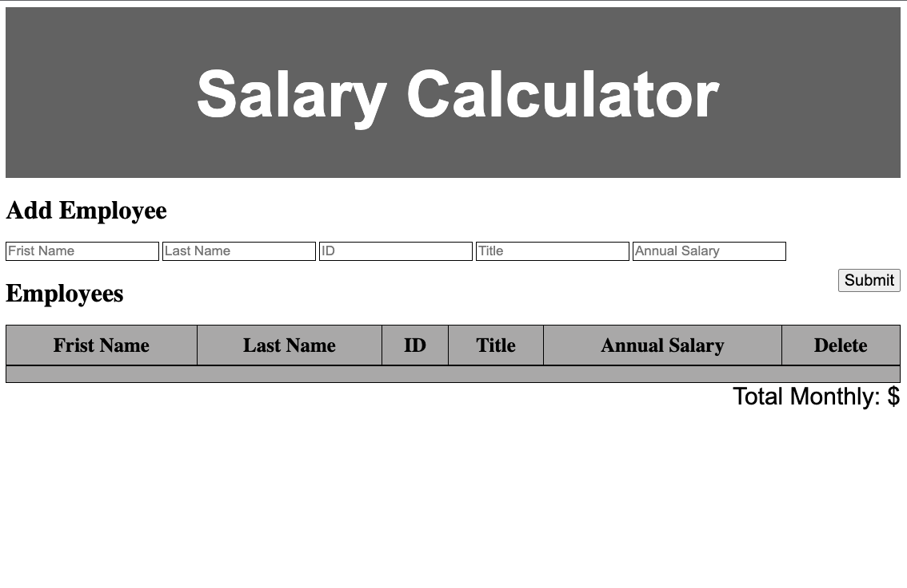

# JavaScript Salary Calculator

This application records employee salaries and adds salaries up to report monthly costs. When the monthly cost exceeds 20.000 it will display a red sign.

## Topics Covered
- JavaScript
- Selectors, appending to the DOM, and event handling
- HTML Forms

## Project Description

The application has an input form that collects employee first name, last name, ID number, job title, annual salary.

A 'Submit' button collects the form information, stores the information to calculate monthly costs, appends the information to the DOM and clears the input fields. This app calculates monthly costs and appends this to the to DOM. When the total monthly cost exceeds $20,000, a red background color will be added to the total monthly cost.

It has a delete button that removes an employee from the DOM.

### Images of the application

## Credits

This project was based on an activitie from Prime Academy.
